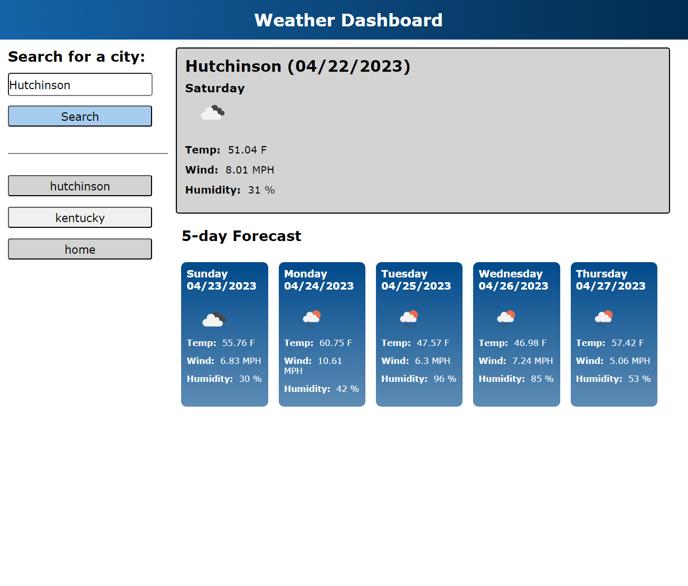

# Scheduler

- Website that allows a user to plan out their work day, with a color displaying the period of the day.

## User Story

- AS A traveler
- I WANT to see the weather outlook for multiple cities
- SO THAT I can plan a trip accordingly

## Acceptance Criteria

- GIVEN a weather dashboard with form inputs
- WHEN I search for a city
- THEN I am presented with current and future conditions for that city and that city is added to the search history
- WHEN I view current weather conditions for that city
- THEN I am presented with the city name, the date, an icon representation of weather conditions, the temperature, the humidity, and the wind speed
- WHEN I view future weather conditions for that city
- THEN I am presented with a 5-day forecast that displays the date, an icon representation of weather conditions, the temperature, the wind speed, and the humidity
- WHEN I click on a city in the search history
- THEN I am again presented with current and future conditions for that city

## Assets

The following image demonstrates the web application's appearance at full screen:

---

- index.html
- README.md
- screenshot.png
- script.js
- style.css

---

## Outside Sources

- https://openweathermap.org/api

---

© 2023 edX Boot Camps LLC. Confidential and Proprietary. All Rights Reserved.
