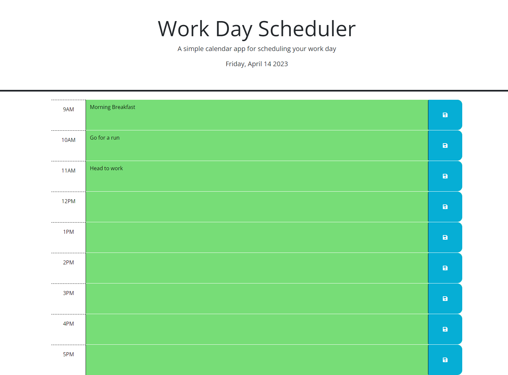

# Scheduler

- Website that allows a user to plan out their work day, with a color displaying the period of the day.

## User Story

- AS A user that works on a normal time schedule
- I WANT a schedule that I can modify and save info
- SO THAT I stay organized and have an easy to read display of my schedule

## Acceptance Criteria

- GIVEN I am using a daily planner to create a schedule
- WHEN I open the planner
- THEN the current day is displayed at the top of the calendar
- WHEN I scroll down
- THEN I am presented with time blocks for standard business hours
- WHEN I view the time blocks for that day
- THEN each time block is color-coded to indicate whether it is in the past, present, or future
- WHEN I click into a time block
- THEN I can enter an event
- WHEN I click the save button for that time block
- THEN the text for that event is saved in local storage
- WHEN I refresh the page
- THEN the saved events persist

## Assets

The following image demonstrates the web application's appearance at full screen:

---

- index.html
- README.md
- screenshot.png
- script.js
- style.css

---

© 2023 edX Boot Camps LLC. Confidential and Proprietary. All Rights Reserved.
